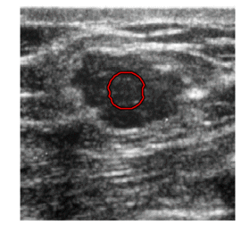
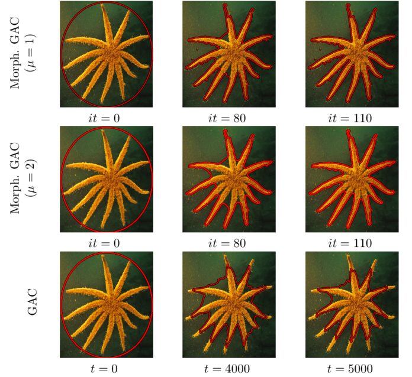
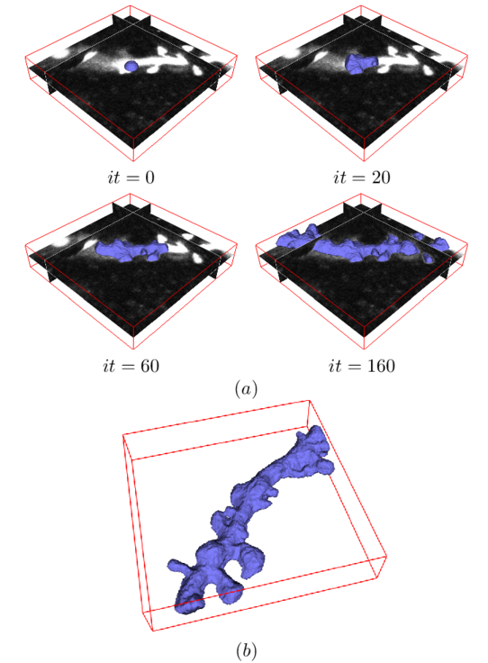

# Morphological Snakes

The **Morphological Snakes** are a family of related methods for image-guided
evolution of curves and surfaces represented as a level-set of an embedding
function. They have application in several computer vision areas, such as
tracking and image segmentation.

The first ideas of **Morphological Snakes** were introduced in [2], [1]
completes that work describing the underlying mathematical foundations,
extending the application to the two-dimensional and three-dimensional cases,
and introducing two new algorithms: **Morphological Geodesic Active Contours** and
**Morphological Active Contours Without Edges**.

## Background

The contour evolution methods have been known in the Computer Vision community
for years, perhaps being the **Geodesic Active Contours** and the **Active Contours
without edges** the two most prominent examples. They both try to find a contour
that serves as a boundary to separate the image in two areas (usually called
**foreground** and **background**) based on the contents of the image. Both methods
work by solving partial differential equations (PDEs) on an embedding function
that has the contour as its zero-levelset.

The morphological snakes aim to provide a very fast, simple and stable
approximation to the solution of these PDEs. They do so substituting the terms
of the PDE by the repeated application of morphological operators over a binary
embedding function.

The **morphological operators** are defined as translation and contrast-invariant
operators. A morphological operator transforms an input function depending only
on the shape of its levelsets. For example, two very well known morphological
operators are the **dilation** and the **erosion**.

## Brief theoretical description

The PDE for the Geodesic Active Contours (GAC) is

This PDE is the sum of three terms. From left to right, the smoothing term, the
balloon term and the image attachment term. It is well-known that the balloon
term can be solved by the repeated application of a dilation (or erosion)
operator with a small radius. Similarly, it is easy to simulate the image
attachment term with simple binary rules. However, it is not so easy for the
smoothing term.

[1] introduces a new morphological operator, the **curvature operator**, and
proves that it is a very good approximation to the mean curvature flow given by
the smoothing term. With this new operator, [1] also introduces the
**Morphological Geodesic Active Contours** (MorphGAC).

The MorphGAC consists of the approximation to the above PDE of the GAC with
the composition of the dilation, the erosion and the curvature operator. 

In a very similar way, the Active Contours without Edges (ACWE) evolves the
embedding function using the PDE

[1] describes the Morphological ACWE (MorphACWE) approximating this PDE with
the dilation, the erosion and the curvature operator.

## Examples

The images below show some working examples of the Morphological Snakes.

### MorphGAC

### MorphACWE

## Implementation

The code provided is a Python implementation of the Morphological Snakes
methods. It does not aim to be a fast or efficient implementation. Instead, it
is intended to be as brief, understandable and self-contained as possible.

The code is documented and in ``tests.py`` there are some usage examples.

## Comparison

## References

[1]: *A morphological approach to curvature-based evolution
   of curves and surfaces*. Pablo Márquez-Neila, Luis Baumela, Luis Álvarez.
   In IEEE Transactions on Pattern Analysis and Machine Intelligence (PAMI).

[2]: *Morphological Snakes*. Luis Álvarez, Luis Baumela, Pablo Márquez-Neila.
   In Proceedings of the IEEE Conference on Computer Vision and Pattern Recognition 2010 (CVPR10).

